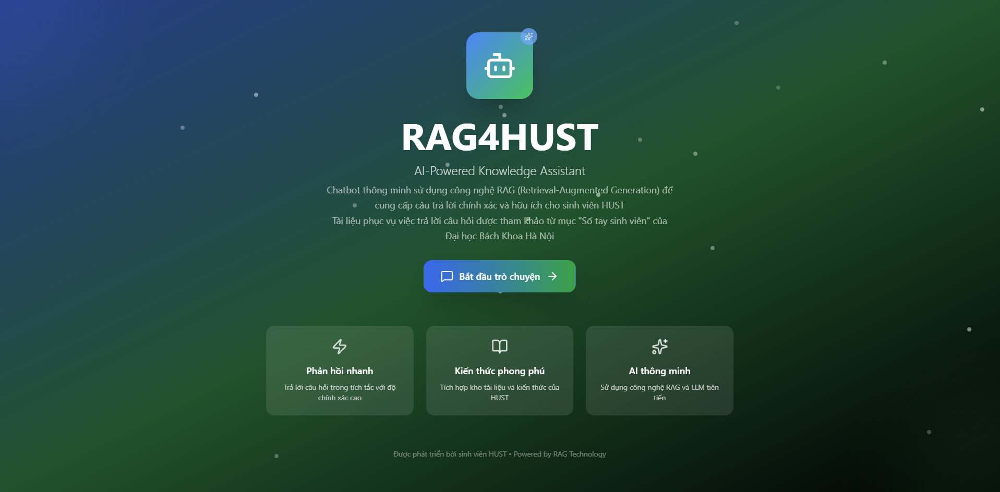
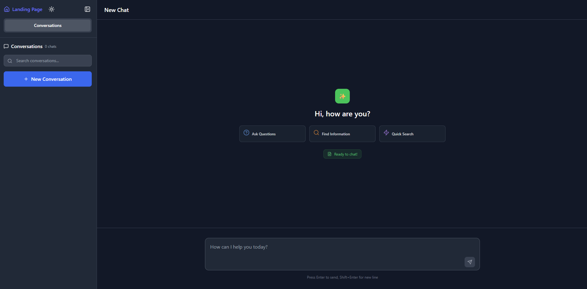
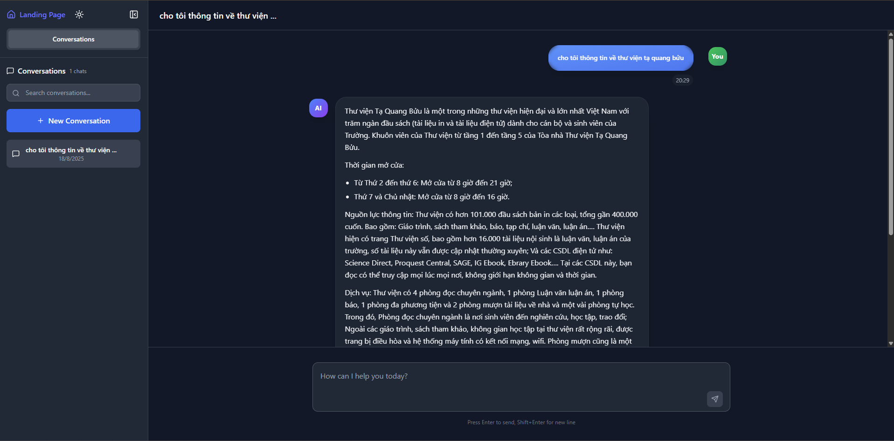

# rag4hust

## Tài liệu dự án được lấy từ "SỔ TAY SINH VIÊN" của Đại Học Bách khoa Hà Nội 

## 📚 Chatbot RAG - Retrieval-Augmented Generation Chatbot

Dự án này là một chatbot thông minh dựa trên kỹ thuật **RAG (Retrieval-Augmented Generation)**, kết hợp giữa mô hình ngôn ngữ lớn (LLM) và các tài liệu được lưu trữ để trả lời các câu hỏi chính xác và bám sát ngữ cảnh.

### Trải nghiệm thử [TẠI ĐÂY](https://rag4hust.vercel.app/)
---

## Giới thiệu 

## 🧠 Mục tiêu

- Tích hợp LLM để hiểu và sinh ngôn ngữ tự nhiên.
- Tìm kiếm thông tin trong tập tài liệu riêng (PDF, DOCX, TXT,...) để tăng độ chính xác.
- Hỗ trợ tiếng Việt (ưu tiên) và có thể mở rộng sang đa ngôn ngữ.
- Giao diện tương tác qua CLI hoặc Web.

---

## 🧰 Công nghệ sử dụng

- **LangChain** – framework hỗ trợ xây dựng pipeline RAG.
- **ChromaDB** – lưu trữ vector embedding và truy xuất.
- **SentenceTransformer / HuggingFace Embeddings** – tạo embedding cho văn bản.
- **LLM** – có thể dùng `gemma`,, v.v.
- **Streamlit / Gradio / Flask** – giao diện người dùng (tùy chọn).

---

